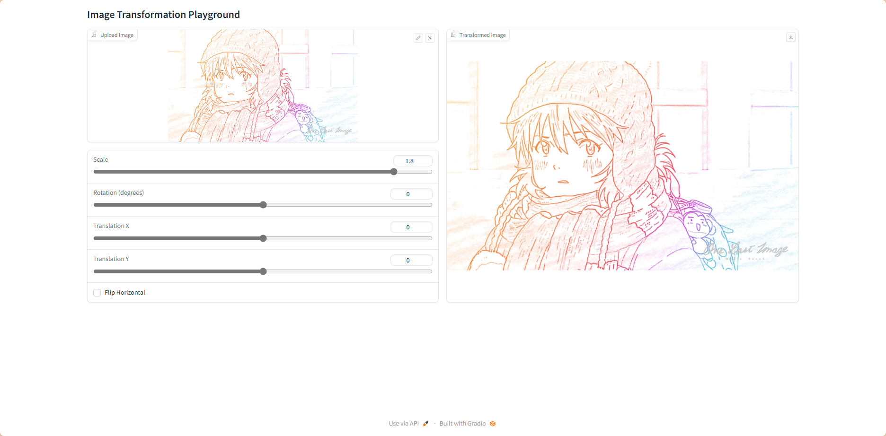
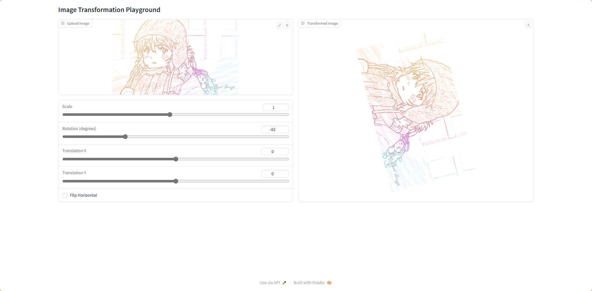
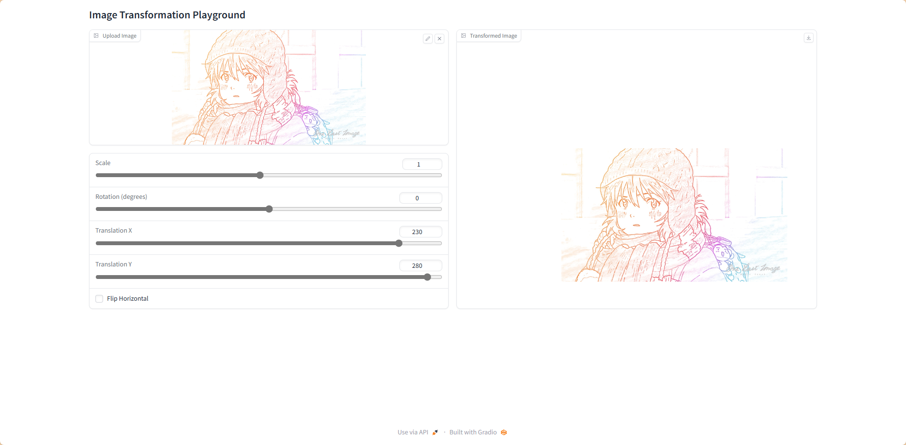
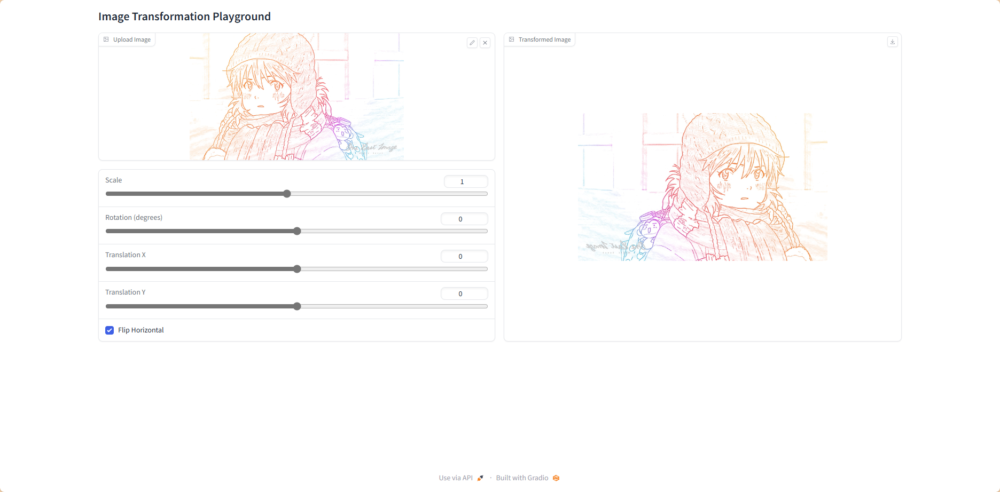
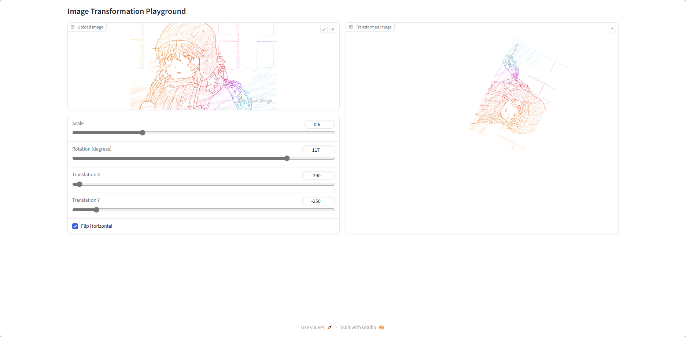
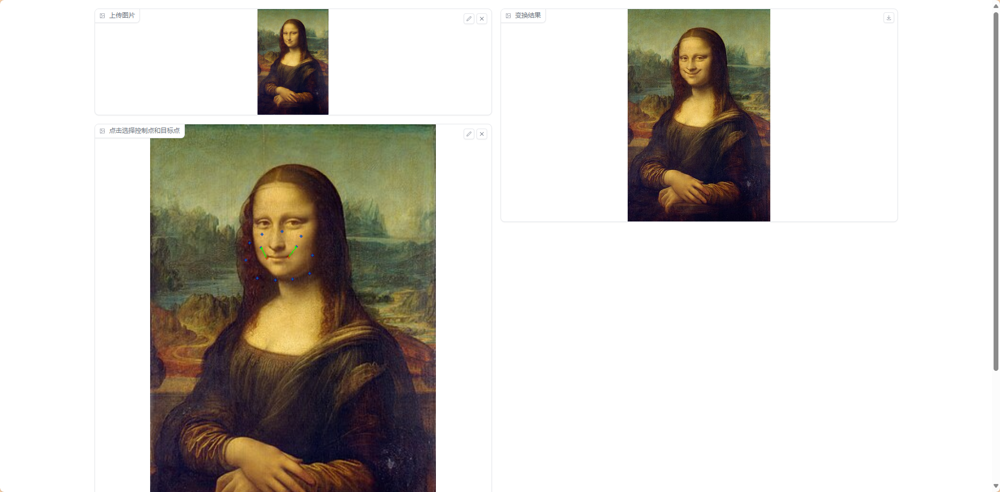
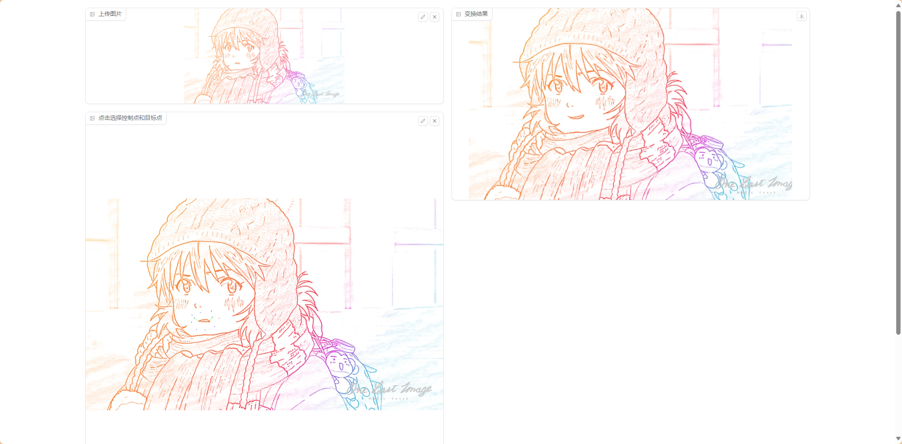

# Report for Assignment 1

## 运行环境
`git clone https://github.com/Abysswalker19/DIP.git`

`cd DIP/Assignments/01_ImageWarping`

`pip -m requirements.txt`

### 全局变换
`python run_global_transform.py`

### warping
`python run_point_transform.py`

## 结果

### 全局变换

1. scale

2. rotation

3. translation

4. flip

5. all

### warping

