# 02_DIPwithPyTorch


## Poisson Image Editing with PyTorch

### Method
Use laplacian kernel to do convolution on foreground_img and blended_img, then compute the loss between them. Optimize the loss to make $\Delta f=\Delta v$.

### Run

```
python run_blending_gradio.py
```

### Results

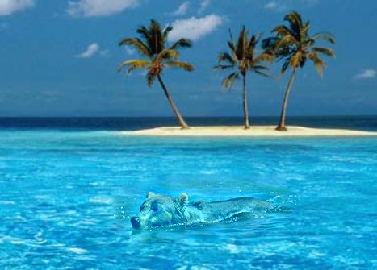

## Pix2Pix

This repository is the official implementation of [02_DIPwithPyTorch](https://github.com/Abysswalker19/DIP/tree/main/Assignments/02_DIPwithPyTorch). 


### Requirements

To install requirements:

```setup
pip install -r requirements.txt
```

### Training

To train the model in the paper, run this command:

```train
cd DIP/Assignments/02_DIPwithPyTorch/Pix2Pix
python train.py 
```

### Pre-trained Models

You can download pretrained models here:
- [facades](./assets/facades/pix2pix_model_epoch_800.pth)

- [cityscapes](./assets/city/pix2pix_model_epoch_800.pth)

- [cityscapes with more layer](./assets/city1/pix2pix_model_epoch_500.pth)

### Results


#### few channels and small dataset

channels : 32

dataset : facades

- train_results

The left is the origin picture, the middle is the structure of the picture, and the right is the output of the model.

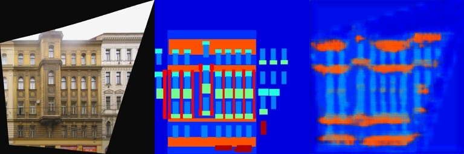
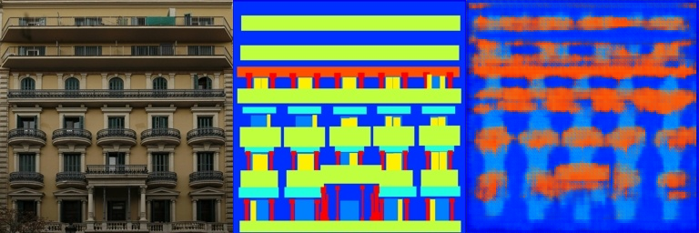

- val_results

The left is the origin picture, the middle is the structure of the picture, and the right is the output of the model.

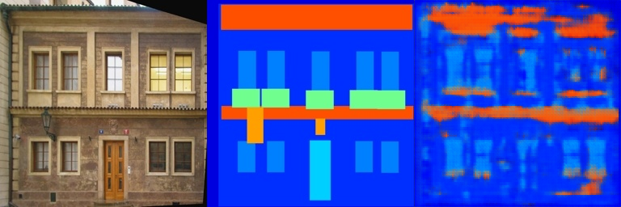
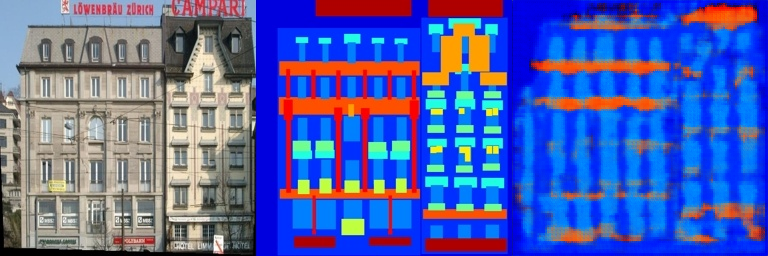


- loss

About 0.37.

#### few channels and bigger datasets

channels : 32

dataset : cityscapes

- train_results

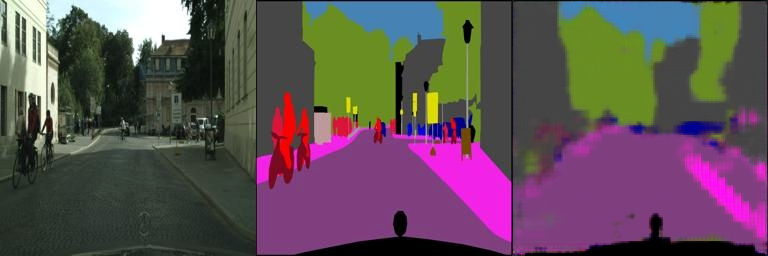
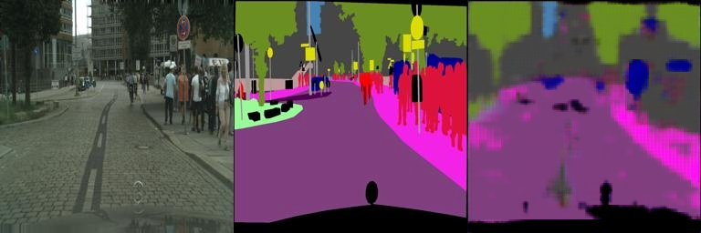

- val_results

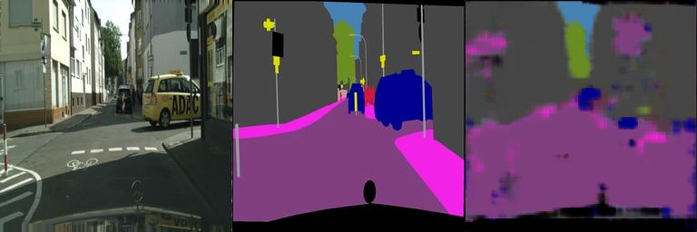
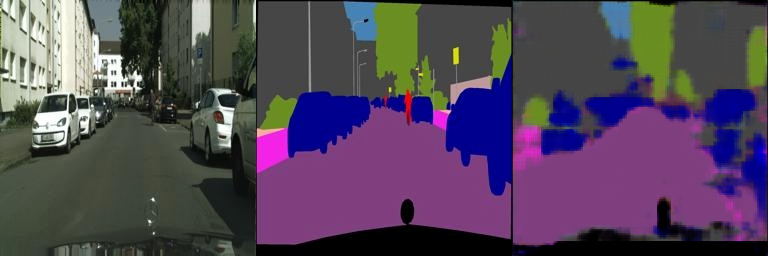


- loss

About 0.14

#### more channels and small datasets

Because the result above is not good enough, so I add more channels and another convolution layer, and add dropout to avoid overfitting.

channel : 128

dataset : cityscapes

dropout probability : 0.1

- train_results

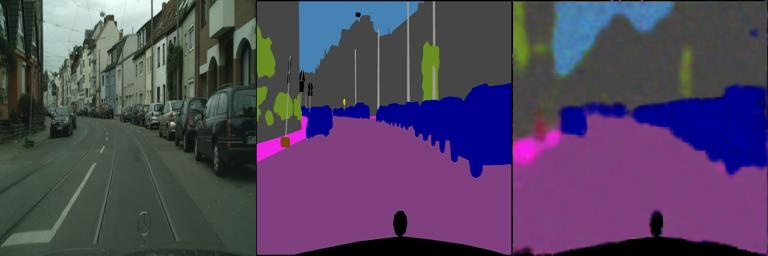
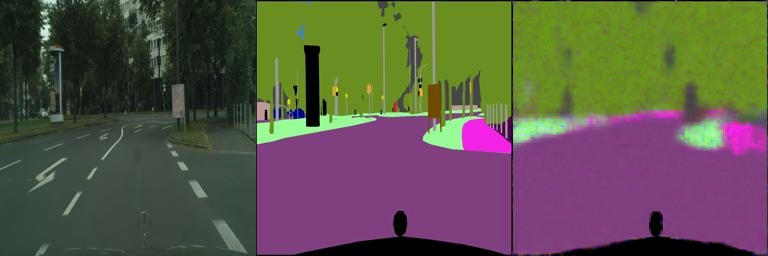

- val_results

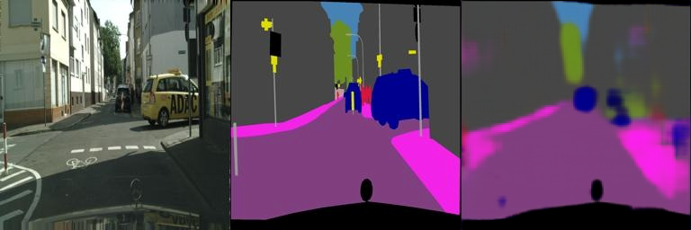
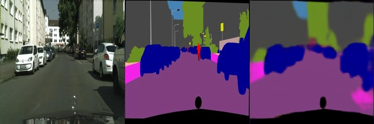

- loss

About 0.10