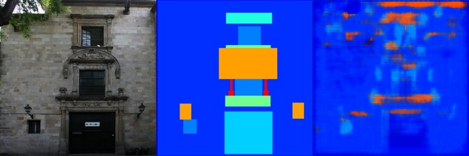

# 02_DIPwithPyTorch


## Poisson Image Editing with PyTorch

### Method
Use laplacian kernel to do convolution on foreground_img and blended_img, then compute the loss between them. Optimize the loss to make $\Delta f=\Delta v$.

### Results


## Pix2Pix

This repository is the official implementation of [02_DIPwithPyTorch](https://github.com/Abysswalker19/DIP/tree/main/Assignments/02_DIPwithPyTorch). 


### Requirements

To install requirements:

```setup
pip install -r requirements.txt
```

### Training

To train the model in the paper, run this command:

```train
cd DIP/Assignments/02_DIPwithPyTorch/Pix2Pix
python train.py 
```

### Pre-trained Models

You can download pretrained models here:

- [checkpoints_800epoch](./assets/pix2pix_model_epoch_800.pth)

### Results

- train_results

The left is the origin picture, the middle is the structure of the picture, and the right is the output of the model.


- val_results

The left is the origin picture, the middle is the structure of the picture, and the right is the output of the model.


