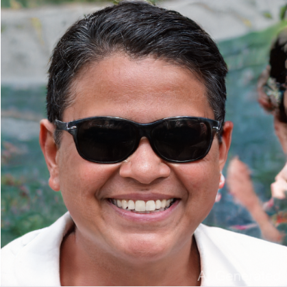

# 03_PlayWithGANs

## Incremental Pix2Pix

### Method

In this part, a conditional GAN is trained to map segment image to rgb image. The generator is the same as the generator in Assignment 2, and the discriminator is also implemented using CNN. In the last layer, a fully connected network is used to map multi channels to a one dimention probability.

To train a conditional GAN, it's necessary to change the loss function for L1 to cGAN loss. The origin loss is

 $$\mathcal{L}_{cGAN}=\mathbf{E}_{x,y}[logD(x, y)]+\mathbf(E)_{x,z}[log(1-D(x,G(x,z))]$$

And it is the same as the binary cross entropy loss in this case, so I use this as the loss function.

### Run

To train the condition GAN, just run

```
cd Assignments/03_PlayWithGANs/Pix2Pix
python train.py
```
You can also download the pretrain models.

For dataset facades, [facades](./assets/pretrain/facades/).

For dataset cityscapes, [cityscapes](./assets/pretrain/cityscapes/)

### Result

The result is showed below:

- cityscapes


- facades


## Draggan

### Method

To implement auto face editing, first use [face-alignment](https://github.com/1adrianb/face-alignment?tab=readme-ov-file) tools to get the face keypoints.

Then put the points and the image into draggan, use draggan to drag the keypoints to the given place.

For now, it can be used to make a person smile, make a person's face thinner, make a person's eyes bigger and make a person's eyes close.

### How to use

To use the editor, you need to upload a face image of a person, and then click the button called "smile", "thin face", "big eyes" and "close eyes".

Once you click a button, you can see the red and blue points, and then, you should click the "Start" button to begin drag. If you think the red and blue points are close enough, you can click the "Stop" button, and you can get a image edited.

If you want to change to another function, remember to click "Reset points", then do the instructions above again.

### Result 

Here's the result of the combination of the two works.

- Smile

    - before
    
    - after
    

- Thin face
    - before
    
    - after
    

- Big eyes 
    - before
    
    - after
    

- Close eyes
    - before
    
    - after
    