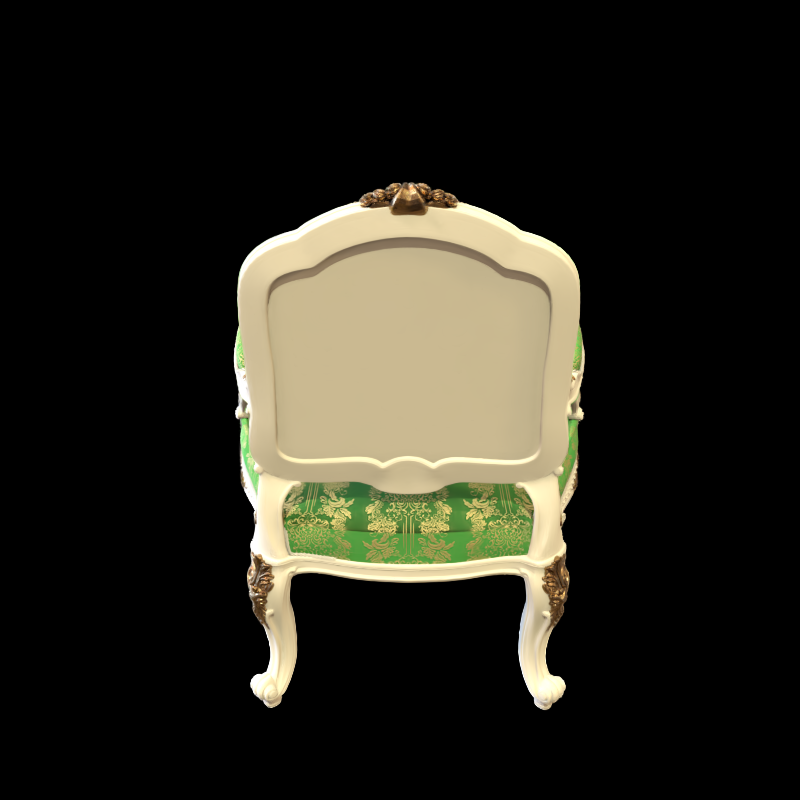
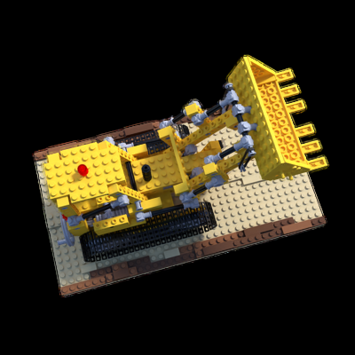

# 04_3DGS

## run

First, we use Colmap to recover camera poses and a set of 3D points.

```python mvs_with_colmap.py --data_dir data/chair```

Debug the reconstruction by running:

```python debug_mvs_by_projecting_pts.py --data_dir data/chair```

To train the 3dgs:

```python train.py --colmap_dir data/chair --checkpoint_dir data/chair/checkpoints```

### result

150个epoch的时候loss已经基本不下降了

chair第150个epoch的结果


视频结果


Loss = 0.0275

原版高斯结果



Loss = 0.0055

lego第150个epoch的结果


视频结果


原版高斯结果



Loss = 0.0130